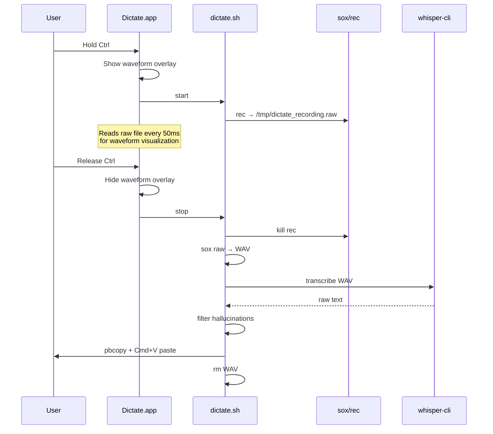
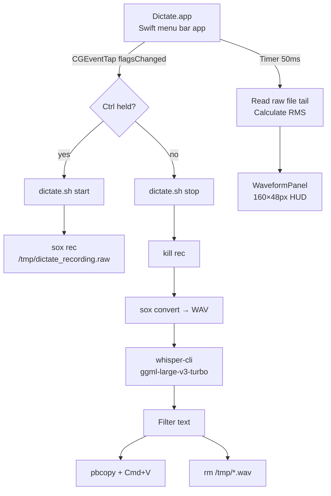
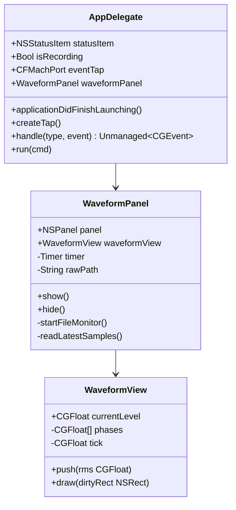

# Dictate

**Local speech-to-text for macOS. Hold Ctrl → speak → release → text appears.**

No cloud. No API keys. No subscription. No data leaves your machine.

---

## Why

Voice dictation tools that actually work tend to come with a catch: your audio goes to a server, a company stores it, a model is trained on it. [Whisper Flow](https://wisprflow.ai) is excellent, but it requires an internet connection and a paid subscription.

Dictate is the offline alternative. It runs [Whisper large-v3-turbo](https://github.com/ggerganov/whisper.cpp) locally on your Mac, uses `sox` to capture audio, and pastes the result directly into whatever app you're using. That's it. When you release Ctrl, the recording is transcribed and immediately deleted — nothing is stored anywhere.

The whole thing is ~320 lines of Swift and ~100 lines of Bash.

---

## How it works

```
Hold Ctrl → rec captures audio to /tmp → release Ctrl →
sox converts to WAV → whisper-cli transcribes →
text copied to clipboard → Cmd+V pasted → files deleted
```

### Recording flow



### Architecture



---

## Privacy model

| What | Where it goes |
|------|--------------|
| Audio during recording | `/tmp/dictate_recording.raw` (deleted on stop) |
| WAV for transcription | `/tmp/dictate_recording.wav` (deleted immediately after) |
| Transcribed text | Your clipboard → pasted — nowhere else |
| Whisper model | Local file `models/ggml-large-v3-turbo.bin` |
| Network requests | **None** |
| Logs | `/tmp/dictate_app.log` (local, no audio content) |

---

## Requirements

- macOS 12+
- [Homebrew](https://brew.sh)
- Xcode Command Line Tools (`xcode-select --install`)

---

## Installation

```bash
# 1. Install dependencies
brew install whisper-cpp sox

# 2. Clone
git clone https://github.com/0x0ndra/dictate.git
cd dictate

# 3. Download Whisper model (~1.5 GB)
mkdir -p models
curl -L -o models/ggml-large-v3-turbo.bin \
  https://huggingface.co/ggerganov/whisper.cpp/resolve/main/ggml-large-v3-turbo.bin

# 4. Build
swiftc -O -o Dictate.app/Contents/MacOS/Dictate Dictate.swift \
  -framework Cocoa -framework AVFoundation -framework ApplicationServices

# 5. Sign (ad-hoc — no Apple account needed)
codesign --force --sign - Dictate.app

# 6. Install
cp -R Dictate.app /Applications/
cp dictate.sh /Applications/
cp -R models /Applications/models

# 7. Launch
open /Applications/Dictate.app
```

On first launch, grant **Microphone** (dialog) and **Accessibility** (System Settings → Privacy & Security → Accessibility).

For auto-start at login: **System Settings → General → Login Items → add Dictate.app**

---

## Usage

| Action | Result |
|--------|--------|
| Hold **Ctrl** | Recording starts, waveform overlay appears bottom-center |
| Speak | Audio captured, waveform responds in real time |
| Release **Ctrl** | Transcription runs, text pasted into active window |
| Click menu bar icon → **Quit** | Exit |

### Menu bar status icons

| Icon | Meaning |
|------|---------|
| `mic` (outline) | Ready |
| `mic.fill` (filled) | Recording |
| `exclamationmark.triangle` | Accessibility not granted yet |
| `xmark.circle` | Event tap failed — restart app |

### Waveform overlay

A 160×48px frosted-glass panel appears at the bottom center of the screen during recording. It reads the PCM file that `sox` is already writing, so macOS shows only **one** orange microphone indicator (no second mic access from the app).

---

## Language and model

Default language is **Czech** (`--language cs`). To change, edit `dictate.sh`:

```bash
whisper-cli \
  --model "$MODEL" \
  --language en \      # ← change this
  --no-timestamps \
  --suppress-nst \
  --file "$TMPWAV"
```

Available models (place in `models/` next to `dictate.sh`):

| Model | Size | Notes |
|-------|------|-------|
| `ggml-base.bin` | 142 MB | Fastest, lowest accuracy |
| `ggml-small.bin` | 466 MB | Good for English |
| `ggml-medium.bin` | 1.5 GB | Good multilingual |
| `ggml-large-v3-turbo.bin` | 1.5 GB | **Default** — best accuracy, still fast |

---

## Developer reference

### Repository structure

```
dictate/
├── Dictate.swift          # Menu bar app — Swift, ~320 lines
├── dictate.sh             # Recording + transcription — Bash, ~100 lines
├── Dictate.app/
│   └── Contents/
│       ├── Info.plist     # LSUIElement=true, mic permission string
│       └── MacOS/
│           └── Dictate    # Compiled binary (not committed)
├── models/                # Whisper GGML weights (not committed)
│   └── ggml-large-v3-turbo.bin
└── uninstall.sh
```

### Class diagram



### Event tap

Listens for `CGEventType.flagsChanged` system-wide via `CGEvent.tapCreate`. When `maskControl` appears in flags → start. When it disappears → stop.

Requires **Accessibility** permission. The app prompts via `AXIsProcessTrustedWithOptions` and polls every second until granted.

### Waveform: why file-based

An `AVAudioEngine` tap would trigger a second macOS orange microphone indicator alongside `sox`. Instead, the overlay reads the raw PCM file that `sox` writes:

1. Timer fires every 50ms on main thread
2. Opens `/tmp/dictate_recording.raw` read-only
3. Seeks to `fileSize − 3200` bytes (~100ms of 16kHz/16-bit audio)
4. Calculates RMS → dB scale (−85 dB silence → 0.0, −55 dB speech → 1.0)
5. Calls `WaveformView.push()` — applies attack/decay smoothing, triggers redraw

Each bar uses a unique sine phase for organic movement; a bell-curve envelope makes center bars taller than edge bars.

### dictate.sh pipeline

```
sox rec (nohup background)
  └─ /tmp/dictate_recording.raw   (raw PCM 16kHz/16-bit/mono)
kill rec
  └─ sox convert raw → WAV
     └─ whisper-cli --no-timestamps --suppress-nst
        └─ sed: strip timestamps + hallucination patterns
           └─ pbcopy
              └─ osascript: Cmd+V paste
                 └─ rm WAV
```

### Build

```bash
swiftc -O -o Dictate.app/Contents/MacOS/Dictate Dictate.swift \
  -framework Cocoa \
  -framework AVFoundation \
  -framework ApplicationServices
```

No Xcode project, no Package.swift, no third-party dependencies.

### Permissions

| Permission | Why |
|-----------|-----|
| Microphone | `sox rec` captures audio |
| Accessibility | `CGEvent.tapCreate` global hotkey + `System Events` Cmd+V paste |

### Logs

| File | Contents |
|------|----------|
| `/tmp/dictate_app.log` | App lifecycle, accessibility grant, START/STOP events |
| `/tmp/dictate_debug.log` | WAV size, raw Whisper output, filtered text |

No audio data is logged.

---

## Uninstall

```bash
./uninstall.sh
```

---

## Limitations

- **Language**: Czech by default — change `--language` in `dictate.sh`
- **Not on the App Store**: `CGEvent.tapCreate` is sandbox-incompatible
- **Hotkey**: Ctrl is hardcoded — changing it requires editing `Dictate.swift`
- **sox resampling**: Your mic may run at 48kHz/3ch natively; sox converts internally

---

## License

MIT
